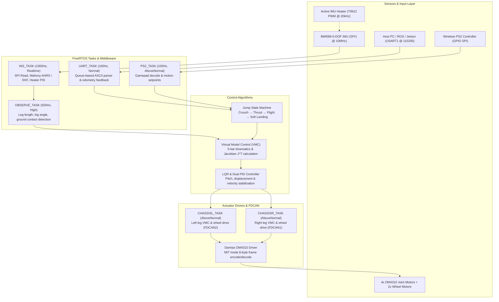

# DM-jump: Wheeled-Bipedal Jumping Robot
### Hệ Thống Robot Bánh - Chân Cân Bằng & Bật Nhảy Tự Hành

<div align="center">

[](https://www.st.com/en/microcontrollers-microprocessors/stm32h723vg.html)
[](https://www.freertos.org/)
[](https://github.com/nguyenbinh-shark/DM-jump)
[](https://www.bosch-sensortec.com/products/motion-sensors/imus/bmi088/)
[](https://github.com/nguyenbinh-shark/DM-jump)
[](https://www.keil.com/)
[](LICENSE)
[](https://github.com/nguyenbinh-shark)
[](https://nguyenbinh-shark.github.io/)

**High-performance, hard real-time embedded control firmware for a Wheeled-Bipedal Jumping Robot on STM32H723VGT6 (ARM Cortex-M7 @ 550MHz) featuring 5-bar linkage kinematics, Virtual Model Control (VMC), LQR dynamic balance, 1000Hz AHRS attitude estimation, and autonomous jump state machine.**

---

**Firmware điều khiển nhúng thời gian thực cao cấp cho Robot bánh - chân nhảy tự hành hai chân trên vi điều khiển STM32H723VGT6 (ARM Cortex-M7 @ 550MHz), cơ cấu 5 khâu kín, Mô hình lực ảo VMC, cân bằng động LQR, ước lượng tư thế 1000Hz và máy trạng thái bật nhảy thông minh.**

[English Documentation](#-english-documentation) • [Tài Liệu Tiếng Việt](#-tài-liệu-tiếng-việt) • [Website Tác Giả](https://nguyenbinh-shark.github.io/)

</div>

---

# 🇬🇧 English Documentation

## 📑 Table of Contents
- [1. Project Overview](#1-project-overview)
- [2. Key Features](#2-key-features)
- [3. Provenance & Comparison with dmBots/wheel-legged](#3-provenance--comparison-with-dmbotswheel-legged)
- [4. System Architecture](#4-system-architecture)
- [5. Hardware Specifications & Pinout](#5-hardware-specifications--pinout)
- [6. Actuator Configuration (CAN Bus)](#6-actuator-configuration-can-bus)
- [7. Control Theory & Mathematical Models](#7-control-theory--mathematical-models)
- [8. Communication & Control Interfaces](#8-communication--control-interfaces)
- [9. Build, Flashing & Debugging Guide](#9-build-flashing--debugging-guide)
- [10. Repository Structure](#10-repository-structure)
- [11. Author, Acknowledgments & License](#11-author-acknowledgments--license)

---

## 1. Project Overview

**DM-jump** is a production-grade embedded robotics firmware developed for dual wheeled-bipedal jumping robots (similar in agility to Tencent Ollie and Ascento robots). It unites the speed and efficiency of wheeled platforms on smooth flat terrain with the obstacle-clearing, height-adjusting, and jumping capabilities of articulated legged systems.

The robot operates with two symmetrical five-bar articulated legs, each driven by two high-torque **Damiao DM4310** brushless motors at the hip joints and an integrated hub wheel motor at the foot point.

---

## 2. Key Features

- **Five-Bar Linkage Kinematics & VMC:** Closed-chain geometric solver maps virtual cartesian ground reaction forces ($F_0$) and hip pitch torques ($T_p$) into individual motor joint torques via the transposed Jacobian matrix $J^T$.
- **1000Hz High-Speed Attitude Estimation:** Industrial 6-DOF **BMI088** IMU (accel + gyro) sampled via high-speed SPI1 at 1 kHz, fused with **Mahony AHRS** and **Quaternion Extended Kalman Filter (EKF)**.
- **Active Thermal Stabilization:** Closed-loop PID control of a MOSFET heating resistor (TIM12 PWM) maintains the IMU die temperature at ~40°C, eliminating thermal zero-rate drift.
- **LQR Dynamic Balancing:** Linear Quadratic Regulator dynamically stabilizes pitch angle ($\theta$), linear displacement ($x$), and forward velocity ($v$) with high disturbance rejection.
- **Autonomous Jump State Machine:** Deterministic finite-state sequence: `Crouch` (energy compression) $\rightarrow$ `Thrust` (full power extension) $\rightarrow$ `Airborne Flight` (passive stabilization) $\rightarrow$ `Soft Landing` (virtual compliance shock absorption).
- **FDCAN Motor Communication:** 1 Mbps Classic CAN frames in Damiao MIT mode ($P_{\text{des}}$, $V_{\text{des}}$, $K_p$, $K_d$, $\tau_{\text{ff}}$) with cycle times below 1ms.
- **Dual Control Interfaces:** Wireless **PS2 gamepad** for low-latency manual piloting and **UART1 ASCII protocol** (115200 baud) for high-level PC, Python, and ROS/ROS 2 automation.

---

## 3. Provenance & Comparison with dmBots/wheel-legged

This project originates from study and benchmarking of the open-source repository [dmBots/wheel-legged](https://github.com/dmBots/wheel-legged) (created by Damiao / dmBots). While referencing the foundational five-bar leg layout and Damiao CAN communication paradigm, **DM-jump** significantly evolves the firmware with major architectural redesigns and new capabilities:

| Feature / Subsystem | Reference Base (`dmBots/wheel-legged`) | DM-jump (This Project) |
|:---|:---|:---|
| **Jumping Dynamics** | Basic wheeled locomotion & height adjustment only | **Autonomous 4-Phase Jump State Machine** (`Crouch` $\rightarrow$ `Thrust` $\rightarrow$ `Flight` $\rightarrow$ `Soft Landing`) with coordinated VMC extension |
| **IMU Thermal Drift** | Unregulated sensor temperature; susceptible to cold/hot bias drift | **Active Closed-Loop PID Thermal Control** maintaining IMU at ~40°C via TIM12 PWM MOSFET |
| **Attitude Fusion** | Baseline complementary / raw filter at lower update rates | **1000Hz Dual Estimation Engine:** Mahony AHRS + Quaternion EKF via 10MHz SPI |
| **Telemetry & Host Automation** | Proprietary or raw debug output | **Standardized ASCII Command Protocol** + 50Hz odometry telemetry feedback (`F<v>,<x>,<yaw>,<yaw_rate>`) ready for ROS/ROS 2 & Python |
| **Input Flexibility** | PS2 gamepad exclusive | **Unified Dual-Mode Control:** Concurrent wireless PS2 gamepad and high-speed UART automation |
| **Software Quality** | Legacy Chinese comments, build artifacts tracked in git | **Clean Professional Standard:** Full bilingual (EN/VI) Doxygen, zero compiler warnings (Keil ARMCC), strict `.editorconfig` & `.clang-format` |

---

## 4. System Architecture

Firmware tasks run concurrently under **FreeRTOS v10**, decoupled into priority-scheduled modules:



---

## 5. Hardware Specifications & Pinout

### Microcontroller (MCU)
- **Part Number:** `STM32H723VGT6` (LQFP-100 package)
- **Core:** 32-bit ARM® Cortex®-M7 with Double-Precision FPU & DSP instructions
- **Clock Speed:** 550 MHz
- **Memory:** 1024 KB Flash, 564 KB SRAM
- **Buses:** Dual FDCAN, SPI, USART, DWT High-Resolution Timer

### Pinout Mapping

| Peripheral | STM32 Pin | Function / Hardware Role | Notes |
|:---|:---|:---|:---|
| **FDCAN1** | `PD0` (RX), `PD1` (TX) | Right Leg CAN Bus (DM4310 Motors) | 1 Mbps Classic CAN |
| **FDCAN2** | `PB5` (RX), `PB6` (TX) | Left Leg CAN Bus (DM4310 Motors) | 1 Mbps Classic CAN |
| **SPI1** | `PA5` (SCK), `PA6` (MISO), `PA7` (MOSI) | BMI088 6-DOF IMU Sensor Bus | High-speed ~10 MHz |
| **CS Gyro** | `PC4` | BMI088 Gyroscope Chip Select | Active LOW |
| **CS Accel** | `PC5` | BMI088 Accelerometer Chip Select | Active LOW |
| **TIM12_CH2** | `PB15` | IMU Heating Resistor PWM Gate | Closed-loop temp control (~40°C) |
| **USART1** | `PA9` (TX), `PA10` (RX) | Host PC / ROS Telemetry & Control | 115200 baud, 8N1 |
| **PS2 Interface** | `PB12` (DAT), `PB13` (CMD), `PB14` (CS), `PB1` (CLK) | 2.4GHz Wireless Gamepad Receiver | Bit-banged SPI protocol |

---

## 6. Actuator Configuration (CAN Bus)

| Joint / Actuator Location | CAN Bus | Transmit ID (Master $\rightarrow$ Motor) | Receive ID (Motor $\rightarrow$ Master) |
|:---|:---:|:---:|:---:|
| **Left Leg - Front Joint (Thigh)** | FDCAN2 | `0x08` | `0x04` |
| **Left Leg - Rear Joint (Calf)** | FDCAN2 | `0x06` | `0x03` |
| **Left Wheel (Drive Hub Motor)** | FDCAN2 | `0x01` | `0x00` |
| **Right Leg - Front Joint (Thigh)** | FDCAN1 | `0x08` | `0x04` |
| **Right Leg - Rear Joint (Calf)** | FDCAN1 | `0x06` | `0x03` |
| **Right Wheel (Drive Hub Motor)** | FDCAN1 | `0x01` | `0x00` |

---

## 7. Control Theory & Mathematical Models

### 1. Five-Bar Linkage Kinematics
Each leg is modeled as a planar closed kinematic chain:
- Link lengths: $l_1 = 0.075\text{ m}$, $l_2 = 0.14\text{ m}$, $l_3 = 0.14\text{ m}$, $l_4 = 0.075\text{ m}$, motor center distance $l_5 = 0.08\text{ m}$.
- Ankle position $C(X_C, Y_C)$ is solved by finding the intersection of circles centered at link knees $B$ and $D$:
$$L_0 = \sqrt{\left(X_C - \frac{l_5}{2}\right)^2 + Y_C^2}, \quad \phi_0 = \arctan2\left(Y_C, X_C - \frac{l_5}{2}\right)$$

### 2. Virtual Model Control (VMC)
Virtual compliance at the wheel ground contact point:
$$F_0 = K_{p0} (L_{0,\text{des}} - L_0) + K_{d0} (0 - \dot{L}_0) + F_{\text{feedforward}}$$
$$T_p = K_{p\phi} (\phi_{0,\text{des}} - \phi_0) + K_{d\phi} (0 - \dot{\phi}_0)$$

Joint motor torques $\tau_1, \tau_4$ are computed using the transposed Jacobian $J^T$:
$$\begin{bmatrix} \tau_1 \\ \tau_4 \end{bmatrix} = J^T \begin{bmatrix} F_0 \\ T_p \end{bmatrix} = \begin{bmatrix} \frac{\partial L_0}{\partial \phi_1} & \frac{\partial \phi_0}{\partial \phi_1} \\ \frac{\partial L_0}{\partial \phi_4} & \frac{\partial \phi_0}{\partial \phi_4} \end{bmatrix} \begin{bmatrix} F_0 \\ T_p \end{bmatrix}$$

### 3. LQR Dynamic Balance
State vector: $x = [\theta, \dot{\theta}, x, \dot{x}, \phi, \dot{\phi}]^T$. The wheel torque is computed via optimal feedback:
$$\tau_{\text{wheel}} = -K_{\text{LQR}} x$$

---

## 8. Communication & Control Interfaces

### ASCII Command Set (USART1 @ 115200 baud)

| Command | Parameter | Scale Factor | Example | Description |
|:---:|:---|:---:|:---|:---|
| `E1` / `E0` | Enable Flag | Integer | `E1\n` | Enable/Disable system control |
| `Vxxx` | Velocity | $\times 1000$ (m/s) | `V500\n` | Set forward speed to 0.500 m/s |
| `Yxxx` | Yaw Rate | $\times 1000$ (rad/s) | `Y300\n` | Set yaw rate to 0.300 rad/s |
| `Hxxx` | Leg Height | $\times 1000$ (m) | `H100\n` | Set leg height to 0.100 m |
| `Rxxx` | Roll Angle | $\times 1000$ (rad) | `R100\n` | Set roll tilt to 0.100 rad |
| `J1` | Jump | Trigger | `J1\n` | Trigger autonomous jumping cycle |
| `B1` | Buzzer | Integer | `B1\n` | Trigger single beep alarm |

### Telemetry Feedback Frame
The firmware transmits periodic feedback frames at 50Hz:
```text
F<velocity>,<position>,<yaw>,<yaw_rate>\r\n
Example: F0.523,1.234,0.785,0.100
```

### Python Host Quickstart Script

```python
import serial
import time

ser = serial.Serial('COM3', 115200, timeout=0.1)
time.sleep(1)

def send_cmd(cmd):
    ser.write(f"{cmd}\n".encode())
    print(f"Sent: {cmd} | Ack: {ser.readline().decode().strip()}")

send_cmd("E1")       # Enable robot
send_cmd("H100")     # Set height to 10cm
send_cmd("V500")     # Drive forward at 0.5 m/s
time.sleep(2)
send_cmd("J1")       # Jump!
time.sleep(2)
send_cmd("V0")       # Stop
send_cmd("E0")       # Disable
ser.close()
```

---

## 9. Build, Flashing & Debugging Guide

1. **Toolchain Requirements:**
   - [Keil MDK-ARM v5.30+](https://www.keil.com/download/product/)
   - ARM Compiler 5 (`ARMCC v5.06 update 7`)
   - `Keil.STM32H7xx_DFP` Device Support Pack
   - Debugger: ST-Link v2/v3, J-Link, or CMSIS-DAP
2. **Build Project:**
   - Open `MDK-ARM/CtrlBoard-H7_IMU.uvprojx` in Keil uVision.
   - Press **F7** to compile (`0 Error(s), 0 Warning(s)`).
3. **Flash:**
   - Connect ST-Link/J-Link, press **F8** to download binary into Flash.

---

## 10. Repository Structure

```text
DM-jump/
├── .github/                     # GitHub CI workflows, issue & PR templates
│   ├── workflows/ci.yml         # Automated CI linting and signature validation
│   ├── ISSUE_TEMPLATE/          # Issue templates
│   └── copilot-instructions.md  # Agent instruction specifications
├── Core/                        # STM32 HAL & FreeRTOS generated by STM32CubeMX
│   ├── Inc/                     # Clock, GPIO, FDCAN, SPI, USART headers
│   └── Src/                     # main.c, freertos.c, stm32h7xx_it.c
├── Drivers/                     # CMSIS and STM32H7xx HAL drivers
├── MDK-ARM/                     # Keil MDK project files
│   └── CtrlBoard-H7_IMU.uvprojx # Primary Keil project
├── Middlewares/                 # FreeRTOS Kernel v10
├── User/                        # APPLICATION CODE & ALGORITHMS
│   ├── APP/                     # FreeRTOS tasks (INS, Chassis, UART, PS2)
│   ├── Algorithm/               # VMC, Mahony AHRS, EKF, PID, Kalman
│   ├── Controller/              # Fuzzy PID adaptive controller
│   ├── Devices/                 # BMI088 IMU driver & DM4310 motor driver
│   ├── Bsp/                     # Board Support Package (DWT, PWM, CAN)
│   └── Lib/                     # Fast math, ramp, deadband utilities
├── docs/                        # Mechanical stress & gear analysis notes
├── CONTRIBUTING.md               # Contribution guidelines
├── LICENSE                      # MIT Open-Source License
└── README.md                    # Project documentation (Bilingual EN/VI)
```

---

## 11. Author, Acknowledgments & License

- **Author:** **Trần Nguyên Bình**
- **Email:** [trannguyenbinh.shark@gmail.com](mailto:trannguyenbinh.shark@gmail.com)
- **Personal Website:** [https://nguyenbinh-shark.github.io/](https://nguyenbinh-shark.github.io/)
- **GitHub Profile:** [@nguyenbinh-shark](https://github.com/nguyenbinh-shark)
- **Project Repository:** [https://github.com/nguyenbinh-shark/DM-jump](https://github.com/nguyenbinh-shark/DM-jump)
- **Reference & Inspiration:** This project references and substantially enhances the open-source work by [dmBots/wheel-legged](https://github.com/dmBots/wheel-legged).

Distributed under the **[MIT License](LICENSE)**. Copyright © 2024–2026 Trần Nguyên Bình.

---

<br>

# 🇻🇳 Tài Liệu Tiếng Việt

## 📑 Mục Lục
- [1. Tổng Quan Dự Án](#1-tổng-quan-dự-án-1)
- [2. Tính Năng Nổi Bật](#2-tính-năng-nổi-bật)
- [3. Nguồn Gốc & Sự Khác Biệt So Với dmBots/wheel-legged](#3-nguồn-gốc--sự-khác-biệt-so-với-dmbotswheel-legged)
- [4. Kiến Trúc Phần Mềm & RTOS](#4-kiến-trúc-phần-mềm--rtos)
- [5. Phần Cứng & Sơ Đồ Chân](#5-phần-cứng--sơ-đồ-chân-1)
- [6. Phân Bổ ID Động Cơ FDCAN](#6-phân-bổ-id-động-cơ-fdcan)
- [7. Cơ Sở Lý Thuyết & Thuật Toán](#7-cơ-sở-lý-thuyết--thuật-toán)
- [8. Giao Thức Điều Khiển & Telemetry](#8-giao-thức-điều-khiển--telemetry)
- [9. Hướng Dẫn Biên Dịch & Nạp Code](#9-hướng-dẫn-biên-dịch--nạp-code)
- [10. Cấu Trúc Thư Mục](#10-cấu-trúc-thư-mục)
- [11. Tác Giả, Lời Cảm Ơn & Bản Quyền](#11-tác-giả-lời-cảm-ơn--bản-quyền)

---

## 1. Tổng Quan Dự Án

**DM-jump** là hệ thống điều khiển nhúng thời gian thực cao cấp dành cho robot bánh - chân nhảy tự hành hai chân (Wheeled-Bipedal Robot). Robot kết hợp ưu điểm di chuyển tốc độ cao, tiết kiệm năng lượng của robot bánh xe trên địa hình phẳng với khả năng co duỗi linh hoạt, thay đổi chiều cao trọng tâm, vượt chướng ngại vật và bật nhảy trên không của robot chân khớp.

Toàn bộ hệ thống cơ khí chân robot được thiết kế theo cơ cấu 5 khâu kín đối xứng, truyền động bởi 4 động cơ không chổi than lực xoắn lớn **Damiao DM4310** ở các khớp đùi và 2 động cơ bánh xe hub-motor ở bàn chân.

---

## 2. Tính Năng Nổi Bật

- **Động học 5 khâu kín & Mô hình lực ảo VMC:** Giải bài toán động học thuận/nghịch và ma trận chuyển vị Jacobian $J^T$ để quy đổi lực ảo pháp tuyến $F_0$ và mô-men ảo $T_p$ thành mô-men xoắn đặt lên hai động cơ khớp hông.
- **Ước lượng tư thế 1000Hz siêu tốc:** Thu thập dữ liệu từ cảm biến công nghiệp 6 trục **BMI088** qua SPI tốc độ cao (10MHz), tích hợp thuật toán lọc **Mahony AHRS** và **Quaternion EKF** cho độ chính xác cao, trễ cực thấp.
- **Mạch sấy chủ động cảm biến IMU:** Bộ điều khiển PID nhiệt độ điều chế độ rộng xung PWM (TIM12) qua MOSFET giữ nhiệt độ chip IMU ổn định ở ~40°C, triệt tiêu hiện tượng trôi điểm 0 theo nhiệt độ.
- **Cân bằng động LQR kết hợp PID:** Điều khiển ổn định góc pitch thân robot, vị trí $x$ và vận tốc $v$, giữ thăng bằng vững vàng kể cả khi chịu ngoại lực tác động.
- **Máy trạng thái bật nhảy thông minh:** Quản lý chu trình nhảy hoàn chỉnh: Nén thế năng (`Crouch`) $\rightarrow$ Búng chân hết công suất (`Thrust`) $\rightarrow$ Bay tự do (`Flight`) $\rightarrow$ Giảm chấn tiếp đất mềm (`Soft Landing`).
- **Giao tiếp FDCAN thời gian thực:** Truyền nhận lệnh theo giao thức Damiao MIT mode ($P$, $V$, $K_p$, $K_d$, $\tau_{\text{ff}}$) ở tần số 1000Hz với độ trễ dưới 1ms.
- **Hỗ trợ điều khiển đa phương thức:** Tích hợp song song tay cầm **PS2 không dây** và cổng **UART1 ASCII** (115200 baud) phục vụ máy tính nhúng, Python script hoặc ROS/ROS 2.

---

## 3. Nguồn Gốc & Sự Khác Biệt So Với dmBots/wheel-legged

Dự án này được nghiên cứu và phát triển dựa trên nền tảng mã nguồn mở [dmBots/wheel-legged](https://github.com/dmBots/wheel-legged) của hãng Damiao (dmBots). Kế thừa cơ cấu 5 khâu và giao thức CAN Damiao, **DM-jump** đã tiến hành tái thiết kế toàn diện, nâng cấp kiến trúc phần mềm và tích hợp hàng loạt tính năng vượt trội:

| Tính năng / Module | Bản gốc (`dmBots/wheel-legged`) | Bản phát triển DM-jump |
|:---|:---|:---|
| **Khả năng bật nhảy** | Chỉ có chế độ di chuyển bánh xe & co duỗi chân cơ bản | **Máy trạng thái bật nhảy tự hành 4 pha** (`Crouch` $\rightarrow$ `Thrust` $\rightarrow$ `Flight` $\rightarrow$ `Soft Landing`), tự động điều tiết lực ảo VMC và hãm bánh trên không |
| **Kiểm soát nhiệt độ IMU**| Không có mạch sấy, dễ trôi điểm 0 khi nhiệt độ môi trường thay đổi | **Mạch sấy chủ động khép kín PID** giữ nhiệt độ chip BMI088 ổn định ở ~40°C qua PWM MOSFET (TIM12) |
| **Ước lượng tư thế (AHRS)** | Bộ lọc bù cơ bản tần số thấp | **Hệ thống kép 1000Hz:** Kết hợp Mahony AHRS và Quaternion EKF qua giao tiếp SPI 10MHz |
| **Giao tiếp PC / ROS** | Giao thức thủ công hạn chế | **Giao thức UART1 mã lệnh ASCII an toàn đa luồng** (Queue/Mutex) kèm luồng telemetry phản hồi 50Hz (`F...`) phục vụ ROS/ROS 2 và Python |
| **Phương thức điều khiển** | Chỉ dùng tay cầm PS2 | **Điều khiển kép linh hoạt:** Vận hành song song tay cầm không dây PS2 và cổng serial tốc độ cao |
| **Chuẩn hóa mã nguồn** | Chú thích tiếng Trung lẫn ký tự lỗi, nhiều file build rác | **Chuẩn mã nguồn cao:** 100% chú thích song ngữ Anh - Việt chuẩn Doxygen, loại bỏ mã lỗi, tuân thủ `.clang-format` và biên dịch tuyệt đối 0 cảnh báo |

---

## 4. Kiến Trúc Phần Mềm & RTOS

Hệ thống được tổ chức phân tầng trên nền tảng **FreeRTOS v10**:
- **INS Task (1000Hz - Realtime Priority):** Đọc cảm biến SPI, tính toán AHRS Quaternion, điều khiển mạch sấy IMU.
- **Observe Task (500Hz - High Priority):** Ước lượng chiều dài chân, góc nghiêng chân, phát hiện trạng thái chạm đất.
- **Chassis Task L/R (AboveNormal Priority):** Tính toán VMC, cân bằng LQR, quản lý máy trạng thái nhảy, gửi nhận frame FDCAN đến động cơ DM4310.
- **PS2 Task (100Hz - AboveNormal Priority):** Đọc tín hiệu cần gạt joystick và nút bấm tay cầm không dây.
- **UART Task (100Hz - Normal Priority):** Hàng đợi nhận lệnh ASCII và gửi telemetry phản hồi thời gian thực.

---

## 5. Phần Cứng & Sơ Đồ Chân

### Thông số phần cứng trung tâm
- **Vi điều khiển:** `STM32H723VGT6` (LQFP-100)
- **Kiến trúc:** ARM® Cortex®-M7 32-bit, FPU chính xác kép, tập lệnh DSP
- **Tần số xung nhịp:** 550 MHz
- **Bộ nhớ nội:** 1024 KB Flash, 564 KB SRAM
- **Giao tiếp:** 2x FDCAN, 1x SPI tốc độ cao, 1x USART, DWT Timer 32-bit

### Sơ đồ chân kết nối

| Ngoại vi | Chân STM32 | Chức năng / Kết nối | Ghi chú |
|:---|:---|:---|:---|
| **FDCAN1** | `PD0` (RX), `PD1` (TX) | Bus CAN chân phải (Động cơ DM4310) | Tốc độ 1 Mbps (Classic CAN) |
| **FDCAN2** | `PB5` (RX), `PB6` (TX) | Bus CAN chân trái (Động cơ DM4310) | Tốc độ 1 Mbps (Classic CAN) |
| **SPI1** | `PA5` (SCK), `PA6` (MISO), `PA7` (MOSI) | Giao tiếp cảm biến IMU BMI088 | Tốc độ cao ~10 MHz |
| **CS Gyro** | `PC4` | Chip Select Con quay hồi chuyển | Kéo mức LOW khi đọc |
| **CS Accel** | `PC5` | Chip Select Cảm biến gia tốc | Kéo mức LOW khi đọc |
| **TIM12_CH2** | `PB15` | Điều xung MOSFET mạch sấy IMU | Điều khiển nhiệt độ ~40°C |
| **USART1** | `PA9` (TX), `PA10` (RX) | Giao tiếp máy tính / ROS / Python | 115200 baud, 8N1 |
| **PS2 Control** | `PB12` (DAT), `PB13` (CMD), `PB14` (CS), `PB1` (CLK) | Tay cầm điều khiển PS2 không dây | Đọc trạng thái nút bấm |

---

## 6. Phân Bổ ID Động Cơ FDCAN

| Vị trí khớp động cơ | Bus CAN | Transmit ID (Gửi lệnh) | Receive ID (Nhận phản hồi) |
|:---|:---:|:---:|:---:|
| **Chân trái - Khớp trước (Đùi trước)** | FDCAN2 | `0x08` | `0x04` |
| **Chân trái - Khớp sau (Đùi sau)** | FDCAN2 | `0x06` | `0x03` |
| **Bánh xe chân trái (Hub motor)** | FDCAN2 | `0x01` | `0x00` |
| **Chân phải - Khớp trước (Đùi trước)** | FDCAN1 | `0x08` | `0x04` |
| **Chân phải - Khớp sau (Đùi sau)** | FDCAN1 | `0x06` | `0x03` |
| **Bánh xe chân phải (Hub motor)** | FDCAN1 | `0x01` | `0x00` |

---

## 7. Cơ Sở Lý Thuyết & Thuật Toán

### 1. Động học cơ cấu 5 khâu kín
Chân robot là hệ đa thanh 5 khâu đối xứng:
- Chiều dài khâu: $l_1 = 0.075\text{ m}$, $l_2 = 0.14\text{ m}$, $l_3 = 0.14\text{ m}$, $l_4 = 0.075\text{ m}$, khoảng cách trục $l_5 = 0.08\text{ m}$.
- Toạ độ mắt cá chân $C(X_C, Y_C)$ được xác định bằng nghiệm giao điểm của 2 cung tròn quay quanh khớp gối $B$ và $D$:
$$L_0 = \sqrt{\left(X_C - \frac{l_5}{2}\right)^2 + Y_C^2}, \quad \phi_0 = \arctan2\left(Y_C, X_C - \frac{l_5}{2}\right)$$

### 2. Mô hình lực ảo (Virtual Model Control - VMC)
Lực ảo đàn hồi tại bàn chân:
$$F_0 = K_{p0} (L_{0,\text{des}} - L_0) + K_{d0} (0 - \dot{L}_0) + F_{\text{feedforward}}$$
$$T_p = K_{p\phi} (\phi_{0,\text{des}} - \phi_0) + K_{d\phi} (0 - \dot{\phi}_0)$$

Quy đổi ra mô-men khớp động cơ $\tau_1, \tau_4$ qua ma trận chuyển vị Jacobian:
$$\begin{bmatrix} \tau_1 \\ \tau_4 \end{bmatrix} = J^T \begin{bmatrix} F_0 \\ T_p \end{bmatrix} = \begin{bmatrix} \frac{\partial L_0}{\partial \phi_1} & \frac{\partial \phi_0}{\partial \phi_1} \\ \frac{\partial L_0}{\partial \phi_4} & \frac{\partial \phi_0}{\partial \phi_4} \end{bmatrix} \begin{bmatrix} F_0 \\ T_p \end{bmatrix}$$

### 3. Cân bằng động LQR
Vector trạng thái thân xe: $x = [\theta, \dot{\theta}, x, \dot{x}, \phi, \dot{\phi}]^T$. Mô-men bánh xe cân bằng tối ưu được tính:
$$\tau_{\text{wheel}} = -K_{\text{LQR}} x$$

---

## 8. Giao Thức Điều Khiển & Telemetry

### Bảng mã lệnh UART1 (115200 baud, 8N1)

| Lệnh | Ý nghĩa | Đơn vị | Hệ số nhân | Ví dụ | Diễn giải |
|:---:|:---|:---:|:---|:---|
| `E1` / `E0` | Cho phép / Khóa động cơ | Boolean | - | `E1\n` | Bật hệ thống cân bằng |
| `Vxxx` | Vận tốc tiến / lùi | m/s | $\times 1000$ | `V600\n` | Đi tiến 0.6 m/s |
| `Yxxx` | Vận tốc quay Yaw | rad/s | $\times 1000$ | `Y300\n` | Quay phải 0.3 rad/s |
| `Hxxx` | Chiều cao chân | m | $\times 1000$ | `H100\n` | Chiều cao chân 0.10 m |
| `Rxxx` | Góc nghiêng Roll | rad | $\times 1000$ | `R50\n` | Nghiêng thân 0.05 rad |
| `J1` | Bật nhảy | Trigger | - | `J1\n` | Kích hoạt chu trình nhảy |
| `B1` | Còi chíp cảnh báo | Integer | - | `B1\n` | Kêu 1 tiếng bíp |

### Khung truyền dữ liệu đo đạc (Telemetry Feedback)
STM32 phát định kỳ dữ liệu trạng thái qua UART1:
```text
F<vận_tốc>,<vị_trí>,<góc_yaw>,<tốc_độ_yaw>\r\n
Ví dụ: F0.523,1.234,0.785,0.100
```

---

## 9. Hướng Dẫn Biên Dịch & Nạp Code

1. **Yêu cầu công cụ:**
   - [Keil MDK-ARM v5.30+](https://www.keil.com/download/product/)
   - Trình biên dịch **ARM Compiler 5** (`ARMCC v5.06 update 7`)
   - Gói vi điều khiển `Keil.STM32H7xx_DFP`
   - Mạch nạp: ST-Link v2/v3, J-Link hoặc CMSIS-DAP
2. **Biên dịch mã nguồn:**
   - Mở file `MDK-ARM/CtrlBoard-H7_IMU.uvprojx` trong Keil uVision.
   - Nhấn **F7** hoặc vào menu `Project -> Build Target`. Kết quả biên dịch: `0 Error(s), 0 Warning(s)`.
3. **Nạp Firmware:**
   - Kết nối mạch nạp vào board mạch STM32H7, nhấn **F8** (`Download`) để nạp chương trình vào chip.

---

## 10. Cấu Trúc Thư Mục

```text
DM-jump/
├── .github/                     # Cấu hình GitHub Actions CI, Issue & PR templates
├── Core/                        # Mã nguồn khởi tạo ngoại vi STM32CubeMX
├── Drivers/                     # Thư viện CMSIS & STM32H7xx HAL Driver
├── MDK-ARM/                     # Dự án Keil uVision 5
├── Middlewares/                 # Mã nguồn FreeRTOS Kernel v10
├── User/                        # MÃ NGUỒN CHÍNH DO TÁC GIẢ PHÁT TRIỂN
│   ├── APP/                     # Các FreeRTOS task (INS, Chassis, UART, PS2)
│   ├── Algorithm/               # VMC, Mahony AHRS, Quaternion EKF, PID, Kalman
│   ├── Controller/              # Bộ điều khiển mờ thích nghi Fuzzy PID
│   ├── Devices/                 # Driver cảm biến BMI088 & Động cơ Damiao DM4310
│   ├── Bsp/                     # Gói hỗ trợ phần cứng (DWT micro-giây, PWM, CAN)
│   └── Lib/                     # Thư viện hàm toán học, bộ tạo dốc Ramp
├── docs/                        # Tài liệu phân tích cơ khí và ứng suất
├── CONTRIBUTING.md               # Quy định đóng góp mã nguồn
├── LICENSE                      # Giấy phép mã nguồn mở MIT
└── README.md                    # Tài liệu dự án song ngữ Anh - Việt
```

---

## 11. Tác Giả, Lời Cảm Ơn & Bản Quyền

- **Tác giả (Author):** **Trần Nguyên Bình**
- **Email:** [trannguyenbinh.shark@gmail.com](mailto:trannguyenbinh.shark@gmail.com)
- **Trang thông tin cá nhân (Website):** [https://nguyenbinh-shark.github.io/](https://nguyenbinh-shark.github.io/)
- **Hồ sơ GitHub:** [@nguyenbinh-shark](https://github.com/nguyenbinh-shark)
- **Kho mã nguồn:** [https://github.com/nguyenbinh-shark/DM-jump](https://github.com/nguyenbinh-shark/DM-jump)
- **Tham khảo & Tri ân:** Dự án được phát triển dựa trên việc nghiên cứu và nâng cấp toàn diện từ repository mã nguồn mở [dmBots/wheel-legged](https://github.com/dmBots/wheel-legged) của Damiao (dmBots).

Phần mềm được phát hành theo giấy phép **[MIT License](LICENSE)**. Bản quyền © 2024–2026 Trần Nguyên Bình.