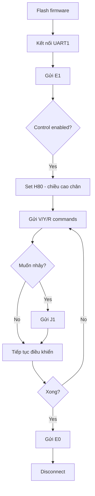

# Hướng dẫn tích hợp và sử dụng UART Control
> **Tác giả:** Trần Nguyên Bình (trannguyenbinh.shark@gmail.com)  
> **Dự án:** DM-jump (https://github.com/nguyenbinh-shark/DM-jump)  
> **Bản quyền:** Copyright (c) 2024-2026 Trần Nguyên Bình. All rights reserved.

---
✅ Mở rộng `UartCmd_t` với đầy đủ tham số điều khiển
✅ Parse lệnh UART cho: V (velocity), X (position), Y (yaw), H (height), R (roll), J (jump), E (enable)
✅ Thêm hàm `uart_data_process()` ánh xạ tương tự PS2
✅ Tạo task mới `UART_CONTROL_TASK` chạy ở 100Hz
✅ Tích hợp vào FreeRTOS với priority `osPriorityNormal`

---

## Kiến trúc hệ thống:

### Task structure:
```
INS_TASK (Realtime)         → IMU + AHRS
OBSERVE_TASK (High)         → State estimation  
CHASSISR_TASK (AboveNormal) → Right leg control
CHASSISL_TASK (AboveNormal) → Left leg control
PS2_TASK (AboveNormal)      → PS2 controller input
UART_TASK (AboveNormal)     → Parse UART commands (RX interrupt)
UART_CONTROL_TASK (Normal)  → Process UART control @ 100Hz
```

### Data flow:
```
UART1 RX → Interrupt → Queue → UART_TASK (parse) → uart_cmd struct
                                                         ↓
                                            UART_CONTROL_TASK (process)
                                                         ↓
                                            uart_data_process() → chassis_move
                                                         ↓
                                            CHASSISR/L_TASK (actuate motors)
```

---

## Cách tích hợp (ĐÃ HOÀN THÀNH):

---

## Cách tích hợp (ĐÃ HOÀN THÀNH):

Task mới đã được tạo tự động trong `freertos.c`:
- ✅ File: `User/APP/uart_control_task.c` và `.h`
- ✅ Task: `UART_CONTROL_TASK` (priority Normal, 256 bytes stack)
- ✅ Frequency: 100Hz (10ms delay)
- ✅ Tự động gọi `uart_data_process()` với delta time chính xác

**Không cần thay đổi gì thêm - chỉ cần build và flash!**

---

## CÁCH SỬ DỤNG

### 1. Kết nối phần cứng:
- **UART1**: 115200 baud, 8 data bits, No parity, 1 stop bit (8N1)
- **TX pin**: Kiểm tra trong STM32CubeMX (thường PA9)
- **RX pin**: Kiểm tra trong STM32CubeMX (thường PA10)
- **Kết nối**: USB-to-Serial adapter hoặc FTDI cable
- **GND**: Nhớ nối chung GND

### 2. Protocol lệnh UART:

#### Format lệnh: `<CHỮ_CÁI><SỐ>\n`

| Lệnh | Chức năng | Đơn vị gốc | Hệ số | Ví dụ | Kết quả |
|------|-----------|------------|-------|-------|---------|
| **E1** | Bật điều khiển | - | - | `E1\n` | Enable control mode |
| **E0** | Tắt điều khiển | - | - | `E0\n` | Disable (hold pose) |
| **Vxxx** | Vận tốc tiến/lùi | m/s | ×1000 | `V800\n` | 0.8 m/s forward |
| **V-xxx** | Vận tốc lùi | m/s | ×1000 | `V-500\n` | -0.5 m/s backward |
| **Yxxx** | Tốc độ quay (yaw rate) | rad/s | ×1000 | `Y500\n` | 0.5 rad/s turn right |
| **Y-xxx** | Quay trái | rad/s | ×1000 | `Y-300\n` | -0.3 rad/s turn left |
| **Hxxx** | Chiều cao chân | m | ×1000 | `H100\n` | 0.1 m = 10 cm |
| **Rxxx** | Góc roll (nghiêng) | rad | ×1000 | `R100\n` | 0.1 rad tilt |
| **R-xxx** | Roll âm | rad | ×1000 | `R-50\n` | -0.05 rad |
| **J1** | Nhảy | - | - | `J1\n` | Trigger jump |
| **Cxxx** | PWM duty (debug) | - | - | `C500\n` | Set TIM12 CCR2=500 |

#### Phản hồi từ STM32:
- **Success**: `OK V=0.800\r\n` (tương ứng với lệnh)
- **Error**: `ERR\r\n` (sai format) hoặc `ERR CMD\r\n` (lệnh không tồn tại)

#### Giới hạn tham số:
- **Leg height (H)**: 60mm - 210mm (tự động clamp nếu vượt quá)
- **Velocity (V)**: Không giới hạn trong code, nhưng nên ≤ 2.0 m/s
- **Yaw rate (Y)**: Không giới hạn, khuyến nghị ≤ 1.0 rad/s
- **Roll (R)**: Không giới hạn, khuyến nghị ±0.3 rad

---

### 3. Sử dụng với Serial Terminal (PuTTY / Tera Term):

#### Cấu hình Terminal:
```
Port:        COMx (check Device Manager)
Baud rate:   115200
Data bits:   8
Parity:      None
Stop bits:   1
Flow control: None
Local echo:  ON (để thấy lệnh gõ)
```

#### Workflow cơ bản:
```bash
# Kết nối terminal → 115200 baud

# Bước 1: Bật điều khiển
E1
→ OK E=1

# Bước 2: Set chiều cao chân an toàn (8cm)
H80
→ OK H=0.080

# Bước 3: Robot bắt đầu di chuyển tiến với v = 0.5 m/s
V500
→ OK V=0.500

# Bước 4: Thêm quay phải (0.2 rad/s)
Y200
→ OK Y=0.200

# Bước 5: Nghiêng sang phải
R50
→ OK R=0.050

# Bước 6: Nhảy
J1
→ OK J=1

# Bước 7: Dừng lại (giữ tư thế)
E0
→ OK E=0

# Bước 8: Reset vận tốc về 0
V0
→ OK V=0.000
```

---

### 4. Sử dụng với Python (Serial Library):

#### Cài đặt thư viện:
```bash
pip install pyserial
```

#### Script Python điều khiển cơ bản:

```python
import serial
import time

# Mở cổng COM
ser = serial.Serial(
    port='COM3',           # Thay đổi theo port của bạn
    baudrate=115200,
    timeout=1
)
time.sleep(2)  # Đợi khởi động UART

def send_cmd(cmd):
    """Gửi lệnh và nhận phản hồi"""
    ser.write(f"{cmd}\n".encode())
    time.sleep(0.05)  # Đợi xử lý
    response = ser.readline().decode().strip()
    print(f"→ {cmd:10s} ← {response}")
    return response

try:
    # 1. Bật điều khiển
    send_cmd("E1")
    time.sleep(0.5)
    
    # 2. Set chân cao 10cm
    send_cmd("H100")
    time.sleep(0.5)
    
    # 3. Đi tiến 0.3 m/s
    send_cmd("V300")
    print("Robot đang đi tiến...")
    time.sleep(3)
    
    # 4. Quay phải với tốc độ 0.4 rad/s
    send_cmd("Y400")
    print("Robot đang quay phải...")
    time.sleep(2)
    
    # 5. Nghiêng sang phải
    send_cmd("R50")
    time.sleep(1)
    
    # 6. Tăng chiều cao chân lên 15cm
    send_cmd("H150")
    time.sleep(1)
    
    # 7. Nhảy
    print("Nhảy!")
    send_cmd("J1")
    time.sleep(2)
    
    # 8. Dừng hẳn
    send_cmd("V0")
    send_cmd("Y0")
    send_cmd("E0")
    print("Đã dừng")
    
except KeyboardInterrupt:
    print("\nDừng khẩn cấp!")
    send_cmd("E0")
    
finally:
    ser.close()
    print("Đã đóng cổng COM")
```

#### Script nâng cao với joystick (keyboard control):

```python
import serial
import keyboard  # pip install keyboard
import time

ser = serial.Serial('COM3', 115200, timeout=1)
time.sleep(2)

def send(cmd):
    ser.write(f"{cmd}\n".encode())
    print(ser.readline().decode().strip())

# Enable control
send("E1")
send("H100")  # 10cm leg height

print("Điều khiển:")
print("W/S: Tiến/Lùi")
print("A/D: Quay trái/phải")
print("Q/E: Nghiêng trái/phải")
print("Space: Nhảy")
print("ESC: Thoát")

try:
    while True:
        if keyboard.is_pressed('w'):
            send("V500")  # Forward
        elif keyboard.is_pressed('s'):
            send("V-500")  # Backward
        elif keyboard.is_pressed('a'):
            send("Y-300")  # Turn left
        elif keyboard.is_pressed('d'):
            send("Y300")  # Turn right
        elif keyboard.is_pressed('q'):
            send("R-100")  # Roll left
        elif keyboard.is_pressed('e'):
            send("R100")  # Roll right
        elif keyboard.is_pressed('space'):
            send("J1")  # Jump
        elif keyboard.is_pressed('esc'):
            break
        else:
            # No key pressed - stop
            send("V0")
            send("Y0")
            send("R0")
        
        time.sleep(0.1)  # 10Hz control rate
        
except KeyboardInterrupt:
    pass
finally:
    send("E0")
    ser.close()
```

---

### 5. ROS Integration (Optional):

```python
#!/usr/bin/env python3
import rospy
from geometry_msgs.msg import Twist
import serial

class UARTController:
    def __init__(self):
        self.ser = serial.Serial('/dev/ttyUSB0', 115200, timeout=1)
        rospy.init_node('uart_controller')
        rospy.Subscriber('/cmd_vel', Twist, self.cmd_vel_callback)
        
        # Enable control
        self.send_cmd("E1")
        self.send_cmd("H100")
        
    def send_cmd(self, cmd):
        self.ser.write(f"{cmd}\n".encode())
        rospy.sleep(0.01)
        
    def cmd_vel_callback(self, msg):
        # Convert Twist to UART commands
        v = int(msg.linear.x * 1000)   # m/s → mm/s
        y = int(msg.angular.z * 1000)  # rad/s → mrad/s
        
        self.send_cmd(f"V{v}")
        self.send_cmd(f"Y{y}")
        
    def run(self):
        rospy.spin()
        
if __name__ == '__main__':
    controller = UARTController()
    controller.run()
```

---

### 6. Workflow điển hình:



#### Checklist sử dụng:
- [ ] 1. Build và flash firmware vào STM32
- [ ] 2. Kết nối UART1 với USB-to-Serial (đúng TX/RX, GND)
- [ ] 3. Mở Serial Terminal hoặc Python script
- [ ] 4. Gửi `E1` → Bật control mode
- [ ] 5. Gửi `H80` → Set chiều cao chân an toàn (8cm)
- [ ] 6. Gửi `V<xxx>` → Điều khiển vận tốc
- [ ] 7. Gửi `Y<xxx>` → Điều khiển góc quay
- [ ] 8. Gửi `R<xxx>` → Điều khiển roll (nghiêng)
- [ ] 9. Gửi `J1` → Nhảy (nếu cần)
- [ ] 10. Gửi `E0` → Tắt control khi hoàn thành

---

### 7. Lưu ý quan trọng:

#### ⚠️ An toàn:
- **LUÔN gửi `E1` trước khi điều khiển** - nếu không robot sẽ không phản hồi
- **Set chiều cao chân hợp lý** (60-210mm) trước khi di chuyển
- **Gửi `E0` để dừng khẩn cấp** - robot sẽ giữ tư thế hiện tại
- **Kiểm tra không gian xung quanh** trước khi test

#### ⚙️ Kỹ thuật:
- Chiều cao chân được **auto clamp**: 60mm ≤ H ≤ 210mm
- Velocity và Yaw rate được **tích phân** thành position và angle
- Task chạy **100Hz** → delay tối đa 10ms
- **Có thể dùng song song với PS2 controller** - cả 2 input đều hoạt động
- **Mutex-protected** - thread-safe khi nhiều task truy cập

#### 🐛 Troubleshooting:

| Vấn đề | Nguyên nhân | Giải pháp |
|--------|-------------|-----------|
| Không nhận phản hồi | Sai COM port hoặc baudrate | Check Device Manager, đảm bảo 115200 baud |
| Nhận `ERR` | Sai format lệnh | Đảm bảo có `\n` ở cuối, format đúng `<CHỮ><SỐ>` |
| Robot không động | Chưa enable | Gửi `E1` trước |
| Chân không đúng chiều cao | Giá trị H quá nhỏ/lớn | Check range 60-210, đơn vị mm |
| Vận tốc sai | Nhầm đơn vị | V500 = 0.5 m/s (×1000) |

---

### 8. Ví dụ tình huống thực tế:

#### Tình huống 1: Di chuyển theo quỹ đạo hình vuông
```python
# Square trajectory (1m × 1m)
send("E1")
send("H100")  # 10cm height

for _ in range(4):
    send("V800")  # Forward 0.8 m/s
    time.sleep(1.25)  # Go 1m
    send("V0")
    
    send("Y1570")  # Turn 90° (π/2 rad/s for 1 sec)
    time.sleep(1)
    send("Y0")

send("E0")
```

#### Tình huống 2: Tăng dần chiều cao chân
```python
send("E1")

for h in range(60, 210, 10):  # 60mm → 210mm
    send(f"H{h}")
    time.sleep(0.5)

for h in range(210, 60, -10):  # 210mm → 60mm
    send(f"H{h}")
    time.sleep(0.5)

send("E0")
```

#### Tình huống 3: Demo khả năng (Full features)
```python
send("E1")

# Phase 1: Walk forward
send("H100")
send("V600")
time.sleep(2)

# Phase 2: Turn while walking
send("Y400")
time.sleep(3)

# Phase 3: Stop turning, tilt body
send("Y0")
send("R100")
time.sleep(1)

# Phase 4: Jump!
send("J1")
time.sleep(1.5)

# Phase 5: Walk backward with tilt
send("V-400")
send("R-100")
time.sleep(2)

# Phase 6: Stop all
send("V0")
send("R0")
send("E0")
```

---

## Tham khảo code hiện có:

- **Parse lệnh**: `User/APP/app_uart.c` → `parse_uart_frame()`
- **Xử lý điều khiển**: `User/APP/app_uart.c` → `uart_data_process()`
- **Task control**: `User/APP/uart_control_task.c` → `UART_Control_Task()`
- **Tích hợp FreeRTOS**: `Core/Src/freertos.c`
- **So sánh với PS2**: `User/APP/ps2_task.c` → `PS2_data_process()`

---

## Mở rộng tương lai:

### Tính năng có thể thêm:
- [ ] Lệnh composite: `M<v>,<y>,<h>,<r>` - gửi nhiều tham số cùng lúc
- [ ] Trajectory planning: `T<x1>,<y1>,<x2>,<y2>` - di chuyển theo điểm
- [ ] Feedback state: `S` → trả về `x, y, yaw, v, h, roll`
- [ ] Binary protocol thay vì ASCII (hiệu quả hơn)
- [ ] Checksum để verify lệnh
- [ ] DMA cho UART RX (giảm CPU load)

---

## Protocol UART1 (115200 baud):

### Các lệnh điều khiển:
- `E1\r\n` - Bật điều khiển (enable)
- `E0\r\n` - Tắt điều khiển (disable)
- `V800\r\n` - Set velocity = 0.8 m/s (giá trị * 1000)
- `X1000\r\n` - Set position X = 1.0 m (giá trị * 1000) [Chưa dùng]
- `Y500\r\n` - Set yaw rate = 0.5 rad/s (giá trị * 1000)
- `H80\r\n` - Set leg height = 0.08 m (giá trị * 1000)
- `R100\r\n` - Set roll angle = 0.1 rad (giá trị * 1000)
- `J1\r\n` - Trigger jump

### Response format:
- Success: `OK V=0.800\r\n` (hoặc X, Y, H, R, J, E tương ứng)
- Error: `ERR\r\n` hoặc `ERR CMD\r\n`

---

## Contact & Support:

- **GitHub Issues**: Report bugs hoặc feature requests
- **Documentation**: Xem thêm tại `copilot-instructions.md`
- **Hardware**: STM32H723 với UART1 @ 115200 baud

**Happy coding! 🚀**
